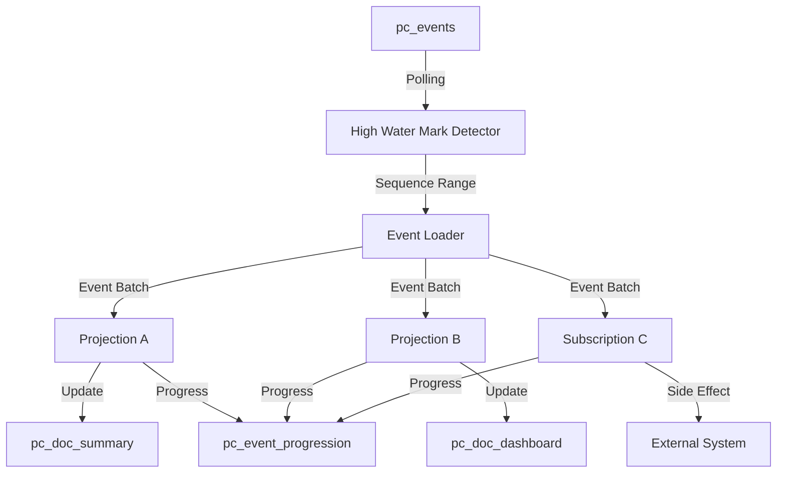

# Asynchronous Projections

The async daemon is a background service that processes events and applies projections asynchronously, providing eventually consistent read models.

## How It Works

1. The **High Water Mark Detector** monitors `pc_events` for new events using SQL `LEAD()` window functions to detect gaps
2. The **Event Loader** fetches batches of events for processing
3. Each projection processes its batch and updates its read model
4. Progress is tracked in `pc_event_progression` via atomic `MERGE` statements

## Enabling the Async Daemon

Register projections with async lifecycle:

```cs
var store = DocumentStore.For(opts =>
{
    opts.Connection("...");

    opts.Projections.Snapshot<OrderSummary>(SnapshotLifecycle.Async);
    opts.Projections.Add<DashboardProjection>(ProjectionLifecycle.Async);
});
```

The daemon starts automatically when the .NET host starts.

## Daemon Settings

Configure daemon behavior:

```cs
opts.DaemonSettings.StaleSequenceThreshold = 1000;
```

### Polling

Unlike Marten's PostgreSQL `LISTEN/NOTIFY`, Polecat uses **polling** to detect new events:

```cs
// The daemon polls for new events at a configurable interval
// Default: 500ms
```

## Waiting for Non-Stale Data

### CatchUpAsync

Wait for all projections to catch up to the current high water mark:

```cs
await store.WaitForNonStaleProjectionDataAsync(TimeSpan.FromSeconds(30));
```

### Per-Query

Wait for projections before a specific query:

```cs
var orders = await session.Query<OrderSummary>()
    .QueryForNonStaleData()
    .Where(x => x.Status == "Active")
    .ToListAsync();
```

## Event Progression

Track daemon progress:

```cs
// The pc_event_progression table stores:
// - name: Projection/subscription name
// - last_seq_id: Last processed sequence ID
// - last_updated: When last updated
```

## High Water Mark Detection

The high water mark detector uses SQL Server's `LEAD()` window function to detect sequence gaps in the event log. This prevents the daemon from processing events out of order when concurrent writers create gaps.

## Error Handling

The daemon uses Polly resilience pipelines for error handling. See [Resiliency Policies](/configuration/retries) for configuration.

## Architecture


